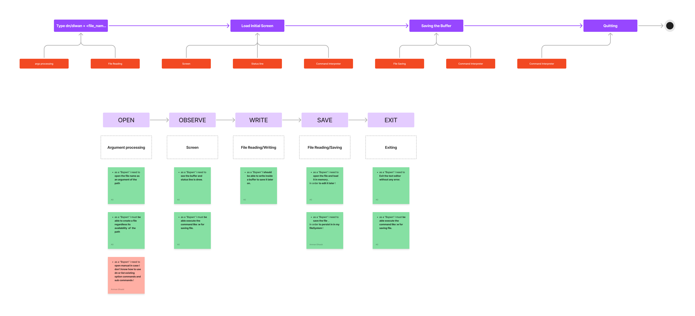

<!-- make the headline bold and font-size biger -->
    <h1 style="font-size: 50px; font-weight: bold;">Diwan</h1>
    
    
    
<!-- with links -->
    
    
    

Diwan is a Rust-based editor designed for performance, memory safety, and concurrency,
providing a fast, efficient, and secure user experience. Inspired by the rich
tradition of Arabic poetry compilations known as "Diwan".

# Contributing

Hey Rustacean! If you're interested in contributing to the project,
feel free to check out Diwan's [official documentation](https://diwan-editor.github.io/Diwan/) for guidelines and details on how to get involved.

# User Journey & To-Do

# Diwan Text Editor - MVP To-Do List

## Logo
- [ ] a logo is needed for Diwan's community.
## Core Features
- [ ] **Implement logic for closing the editor gracefully**  
  Ensure Diwan has a proper mechanism to close, saving any necessary state and cleaning up resources.

- [ ] **Add file saving from the buffer**  
  Enable users to save the current text from the active buffer into a file.

- [ ] **Set up the File Manager component as a crate**  
  Develop a modular file manager to handle file navigation and organization, making it a separate Rust crate.

- [ ] **Load existing files into the editor's buffer**  
  Allow users to open and load text files into Diwan's buffer for editing.

- [ ] **Create new files within the editor**  
  Implement the ability to create and edit new, untitled files directly within the editor.

## User Interface (UI) and Interaction
- [ ] **Design a status line showing key buffer metadata**  
  Display useful information like file name, line/column numbers, and current mode in a status line at the bottom of the editor.

- [ ] **Compose and display a status line in the viewport**  
  Render the status line in the main editor viewport so users can track their file and cursor position.

- [ ] **Add a splash screen on editor startup**  
  Display a simple splash screen when the editor is launched, creating a welcoming visual for users.

## Command Line Interface (CLI)
- [ ] **Support file paths as arguments in the CLI**  
  Enable users to open specific files by passing their file paths as arguments when launching Diwan from the command line.

- [ ] **Show help message for incorrect CLI arguments**  
  Provide informative error messages and usage instructions if the user mistypes or passes incorrect arguments in the CLI.

## Visual Design
- [ ] **Design a logo for Diwan**  
  Create a simple, meaningful logo that represents Diwan and aligns with its aesthetic and functionality.

## Future Additions (Optional for MVP)
- [ ] **Implement a 'boot' feature for the editor**  
  Develop functionality for initializing the editor with custom configurations or presets upon startup.

---

### Notes for Contributors
These tasks represent the core functionality and visual elements needed
to make Diwan a usable text editor. Feel free to propose improvements
or enhancements as you work through the list. Each task should be
approached with modularity and simplicity in mind, following
Rust’s philosophy of safety and performance.
